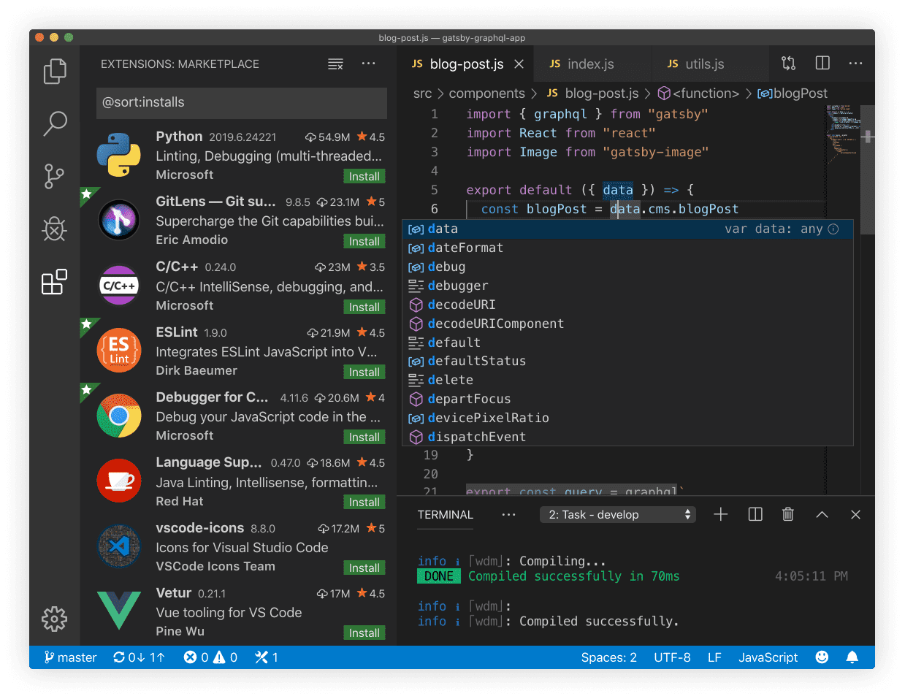

Kamu yang baru memulai atau mugnkin sudah beberapa langkah dalam mempelajari pemrograman web, 10 tool berikut sangat bermanfaat dan sangat membantu dalam mengembangkan projectmu.

Beberapa tool mungkin perlu sedikit konfigurasi menyesuaikan projectmu, tapi itu gak jadi masalah, kita bisa mendapatkan banyak kemudahan dengan tool berikut ini.

# 10 Tool Web Development Populer

## VSCode 🎉

Yang satu ini mungkin gak perlu dikenalkan lagi ya. VSCode adalah kode editor yang powerfull dengan integrasi terminal, kaya akan ekstensi, snippets, tema, shortcut, remote SSH, dan masih banyak lagi.

Kode editor ini terus ditingkatkan oleh Microsoft sebagai proyek [open source](https://github.com/microsoft/vscode).

Kamu bisa mengunduh VSCode di [official web VSCode](https://code.visualstudio.com/).

## Webpack 🥇

Webpack dikenal sebagai bundler modul, tetapi pada kenyataannya, leboh dari itu. Kita bisa menambahkan plugin dan mengubah konfigurasi untuk membuatnya lebih powerfull dan sesuai dengan kebutuhan kita.

Webpack 4 hadir sebagai bundler modul tanpa konfigurasi - itu artinya kamu bisa segera memulai dengan Webpack! Kamuhanya perlu mengunduh modul menggunakan perintah `npm i webpack` dan kemudian jalankan `npx webpack`.

## Cypress 🔮

Cypress adalah alat pengujian e2e yang powerfull. Kita bisa membuat interaksi dengan kode asinkron dengan cara yang sangat intuitif. Misalnya, saat dia menunggu sumber daya tersedia, tidak seperti Selenium, yang merupakan teknologi tua yang dibuat untuk pengujian otomatis sebagian besar web statis.

Cypress sangat sederhana dan ramah untuk ditulis. Kamu bisa download Cypress [di sini](https://www.cypress.io/).

## TypeScript 📽

Kamu lagi nulis JavaScript? Pasti sulit banget nemuin bug atau eror tanpa adanya filter yang tepat. Untuk mengatasi ini, kita bisa memakai modul checking & autocomplete yang ada di TypeScript.

TypeScript adalah superset dari JavaScript yang dialihkan ke JavaScript sebelum dieksekusi. Ini berarti kita menjalankan JavaScript seperti sebelumnya, tetapi dengan pengembangan tambahan dari pengkodean JS dengan cara yang lebih ketat.

Tidak salah jika disebutkan bahwa TypeScript benar-benar memungkinkan pemeliharaan kode JavaScript yang sangat bermanfaat dan membuat refactoring menjadi lebih mudah. Kitadapat mulai belajar TypeScript melalui [dokumentasi TypeScript](https://www.typescriptlang.org/docs/handbook/typescript-in-5-minutes.html).

## Sentry 🐞

Sentry adalah layanan pelaporan bug. Pengguna mungkin mengalami crash atau bug yang tidak terduga dari project yang kita buat. Sentry tersedia di banyak platform, tidak terbatas pada runtime JavaScript. Ini berarti Sentry dapat digunakan dengan kebanyakan teknologi populer.

Sentry akan mengirim informasi tentang bug langsung ke dasbor sehingga kita bisa memperbaiki bug jahat itu pada siklus rilis berikutnya. Baca tentang Sentry [di sini](https://sentry.io/).

## Git 🏆

Git adalah tongkat ajaib dari setiap proyek besar. Git adalah Sistem Kontrol Versi (VCS) yang memungkinkan kita untuk membangun perangkat lunak secara bertahap, sambil mempertahankan history lengkap dari versi sebelumnya.

Tidak hanya itu aja, kita bisa mengerjakan sub-proyek tanpa memengaruhi proyek aslinya. Konsep ini dikenal dengan nama branches.

Solusi paling populer untuk hosting repositori git adalah GitHub. Github menawarkan repositori publik dan pribadi secara gratis. Kita bisa mempelajari lebih lanjut tentang git [di sini](https://git-scm.com/).

## Babel 🎯

Menggunakan babel dengan webpack adalah kombinasi yang sangat powerfull yang memungkinkan kita untuk menggunakan fitur-fitur canggih dan kemudian menggabungkannya. Ini memberikan pengalaman terbaik bagi pengembang saat mengembangkan aplikasi serta menyajikiannya menjadi file yang diperkecil, sehingga mempercepat kinerja.

Misalnya, kita bisa menulis kode ES2020 dalam babel dan membiarkannya bertransformasi ke versi ES2015 untuk dikirimkan ke browser. Ini membuat menulis JavaScript benar-benar menyenangkan dan nyaman karena memungkinkan kita menggunakan JavaScript dari masa depan! Pelajari tentang Babel [di sini](https://babeljs.io/).

## Material UI ⭐️

Materi UI adalah spesifikasi dari Google tentang bagaimana tata letak harus dibuat. Di atas Material UI, ada banyak pustaka komponen yang tersedia untuk beberapa framework seperti Angular, React, atau React Native. Beberapa perpustakaan komponen meliputi:
1.  [Material UI - React](https://material-ui.com/)
2.  [React Native paper](https://callstack.github.io/react-native-paper/)
3.  [Vuetify](https://github.com/vuetifyjs/vuetify)
4.  [Angular Materials](https://github.com/angular/components)

Ini memudahkan proses membangun banyak komponen secara manual untuk pengembang. Dan pada saat yang bersamaan, Material UI menyediakan komponen yang cepat dan dirancang dengan baik. Pelajari tentang Materi UI [di sini](https://material-ui.com/).

## Joi 🌋

Validasi data adalah bagian penting dari aplikasi apa pun. Ini karena kita tidak pernah bisa mempercayai data yang berasal dari pengguna. Untuk aplikasi skala besar, akan  sangat sulit untuk menangani semua kasus.

Joi adalah perpustakaan yang sangat berguna yang membantu kita memvalidasi semua data yang masuk melalui skema yang telah ditentukan sebelumnya. Joi memungkinkan kita membuat skema untuk array, objek, dan bahkan nilai yang harus mereka terima.

Jika input gagal, kita juga bisa menyesuaikan pesan kesalahan. Tidak ada lagi masalah `obj && typeof obj === 'string'` di kode kita lagi! Menggunakan skema Joi tidak hanya aman tetapi juga membuat kode menjadi lebih mudah dibaca oleh pengembang lain. Pelajari lebih lanjut tentang Joi [di sini](https://github.com/hapijs/joi).

## Docker 🛳

Docker adalah platform perangkat lunak yang memungkinkan kita untuk membuat, menguji, dan mereapkan aplikasi dengan cepat.

Di Docker, perangkat lunak dikemas kedalam unit standart yang disebut kontainer yang berisi pustaka, alat sistem, kode, dan waktu proses.

Dengan menggunakan Docker, kita bisa dengan cepat menerapkan dan menskalakan aplikasi ke lingkungan apa pun dan yakin bahwa kode kita akan berjalan jalan.

Itulah 10 tool web development yang harus kalian coba.
