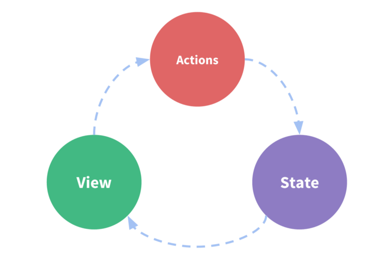

Seperti sebelumnya sudah dijelaskan bahwa komponen dalam Vue.js bersifat independen dan saling terisolasi satu sama lain, sehingga memang dibutuhkan beberapa workaround untuk saling berkomunikasi antar komponen tersebut baik ketika ingin saling melempar data, melempar sebuah event dan lainnya.

## Props

Props merupakan pendekatan paling mudah dan paling diajurkan ketika ingin melempar data dari satu komponen ke komponen lainnya. Pendekatan paling pas menggunakan Props adalah ketika kita ingin melempar data hanya kepada satu komponen lain. Props merupakan one-way data flow sehingga hanya akan berjalan searah yakni dari parent ke child yang menerima Props tersebut, sementara child tidak bisa mengubah nilai Props yang dia terima dan tidak berhak pula melempar data ke parent nya.

Berikut contoh melemparkan data dengan Props kepada komponen lain :

```html
<my-component v-bind:prop1="parentValue" />
<!-- Atau disingkat -->
<my-component :prop1="parentValue" />
```

## Events

Kadangkala selain melemparkan data, kita diharuskan pula melempar Event kepada komponen lain. Maka untuk mengatasi kebutuhan ini, kita bisa menggunakan Events yang dilemparkan ke komponen lain. Sama seperti Props maka penggunaan Events sangat baik bila dilakukan antar 2 komponen. Events juga merupakan one-way flow sehingga child hanya menerima apa yang sudah diberikan oleh parentnya.

Berikut contoh melemparkan Events ke komponen lain :

```html
<my-component v-on:customEvent="parentValue" />
<!-- Atau disingkat -->
<my-component @customEvent="parentValue" />
```

Dan untuk menjalankan Events yang dilemparkan parent maka di komponen child kita bisa menggunakan $emit untuk mengeksekusi Events tersebut. Kita juga bisa menyelipkan parameter ketika melakukan Emit terhadap Events.

Berikut contoh melakukan Emit terhadap sebuah events :

```js
export default {
  methods: {
    fireEvent(value, value2) {
      this.$emit('customEvent', value, value2)
    }
  }
}
```

## Refs

Refs ($refs) memberikan kita akses terhadap methods dari sebuah komponen lain. Hal ini bukan suatu best practice namun terkadang kita membutuhkan akses langsung ke method di dalam suatu komponen child dan disinilah peran Refs dibutuhkan.

Berikut contoh yang diberikan oleh Vue.js dalam menggunakan Refs ini :

```html
<div id="parent">
  <user-profile ref="profile" />
</div>
```

```js
var parent = new Vue({ el: '#parent' })
// access child component instance
var child = parent.$refs.profile
```
## Direct Access

Kita bisa juga melakukan direct akses ke parent maupun child menggunakan `this.$parent` maupun `this.$child`, namun sama dengan `$refs` yang penggunaanya sebaiknya kita batasi pada hal-hal yang sudah tidak bisa diakali menggunakan cara sehat.

Peringatan dari Vue.js mengenai [direct access](https://vuejs.org/v2/api/#parent).

## Event Bus

Bila Events yang kita jelaskan diatas hanya bisa digunakan untuk komponen yang parent-child maka Event Bus adalah salah satu cara untuk berkomunikasi antar komponen yang tidak terikat dengan parent-child. Event Bus memanfaatkan instance baru dari Vue.js sebagai penampung dan kita akan membuat suatu hook baru ke dalam instance ini, kemudian komponen lain bisa mengeksekusi hook ini dengan melakukan $emit terhadap hook tersebut.

Berikut contoh komunikasi yang bukan parent-child di website https://vuejs.org :

```js
// global bus
var bus = new Vue()

// ...
// component A method
bus.$emit('id-selected', 1)

// ...
// component B created hook
bus.$on('id-selected', function(id) {
  // do something
})
```

## State Management

State management memiliki fitur yakni menempatkan berbagai state dari berbagai komponen kedalam satu tempat sehingga mudah untuk digunakan ulang oleh komponen lain. Penggunaan state management atau menempatkan suatu state ke dalam state management paling pas adalah ketika suatu state akan diakses oleh lebih dari 2 komponen dalam satu aplikasi, karena menggunakan Props pasti akan sulit di-maintain kedepannya. Namun menggunakan state management kadangkala juga menjadi terlalu bloated kalau hanya untuk menangani data yang hanya diakses oleh 2 komponen, pada kondisi ini menggunakan Props akan lebih bijak menurut saya.

State management yang bisa digunakan oleh Vue.js sendiri ada banyak, bisa dilihat di [awesome-vue](https://github.com/vuejs/awesome-vue). Namun kalau rekomendasi dari Vue.js adalah menggunakan [Vuex](https://vuex.vuejs.org/).



Demikian artikel pendek ini, semoga bisa membantu kalian yang masih bingung bagaimana caranya berkomunikasi antar komponen Vue.js.

**Semoga bermanfaat…**

Sumber referensi dan bacaan :

- [Vue.js Component Communication Patterns, aligator.io](https://alligator.io/vuejs/component-communication/)

