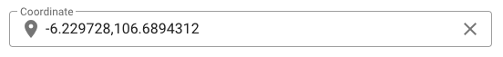

Kita akan membuat komponen koordinat dengan menggunakan [text-field](https://vuetifyjs.com/en/components/text-fields/) pada [Vuetify](https://vuetifyjs.com/), peta [Leaflet](https://leafletjs.com/) pada [nuxt-leaflet](https://github.com/schlunsen/nuxt-leaflet), dan juga pencarian dengan provider [OpenStreetMap](https://smeijer.github.io/leaflet-geosearch/providers/openstreetmap) dengan [leaflet-geosearch](https://github.com/smeijer/leaflet-geosearch).

Langkah-langkah:

1. Menginstall Nuxt

2. Menginstall Vuetify

3. Membuat komponen koordinat

4. Menginstall Leaflet

5. Memakai dialog dan peta OpenStreetMap

## 1. Menginstall Nuxt

Sesuai dengan panduan installasi [Nuxt.js](https://nuxtjs.org/guide/installation/), pada kali ini saya menggunakan [create-nuxt-app](https://github.com/nuxt/create-nuxt-app).

```bash
npx create-nuxt-app <project-name>
```

Kemudian pindah ke direktori tersebut dan jalankan pengembangan.

```bash
cd <project-name>
```

```bash
npm run dev
```

Jika sudah berhasil akan terlihat logo Nuxt.js.

## 2. Menginstall Vuetify

Pada kali ini saya menggunakan [vuetify-module](https://github.com/nuxt-community/vuetify-module) dari [nuxt-community](https://github.com/nuxt-community).

```bash
npm install--save @nuxtjs/vuetify
```

Tambahkan juga `@nuxtjs/vuetify` di `modules` pada `nuxt.config.js`

```js
export default {
  modules: [
    '@nuxtjs/vuetify'
  ]
}
```

## 3. Membuat komponent koordinat

Buat file `components/vuetify/CoordinateField.vue` dengan `text-field` di dalamnya.

```js
<template>
  <div>
    <v-text-field
      @change="textChange($event)"
      v-bind="$attrs"
      v-model="text.value"
      autocomplete="off"
      prepend-inner-icon="mdi-map-marker"
    >
    </v-text-field>
  </div>
</template>

<script>
export default {
  props: {
    value: {
      default: '0,0',
      type: String
    }
  },
  data() {
    return {
      text: {
        value: this.value
      }
    }
  },
  watch: {
    value: function(value) {
      this.text.value = value
    }
  },
  methods: {
    textChange(value) {
      this.$emit('input', value)
    }
  }
}
</script>
```

Dan ubah `pages/index.vue` untuk memanggil komponen tersebut.

```js
<template>
  <v-container>
    <CoordinateField
      v-model="coordinate"
      clearable
      dense
      label="Coordinate"
      outlined
    />
  </v-container>
</template>

<script>
import CoordinateField from '~/components/vuetify/CoordinateField'

export default {
  components: {
    CoordinateField
  },
  data() {
    return {
      coordinate: '-6.229728,106.6894312'
    }
  }
}
</script>
```

Sehingga tampilan menjadi



## 4. Menginstall Leaflet

Beberapa paket yang dipakai:

- [nuxt-leaflet](https://github.com/schlunsen/nuxt-leaflet)

```bash
npm install --save nuxt-leaflet
```

Tambahkan `nuxt-leaflet` pada `modules` di `nuxt.config.js`.

```js
{
  modules: [
    'nuxt-leaflet'
  ]
}
```

- [vue2-leaflet-fullscreen](https://github.com/mikeu/vue2-leaflet-fullscreen) untuk melakukan full screen.

```bash
npm install --save vue2-leaflet-fullscreen
```

Saya juga membuat `/plugins/leafleat.js` untuk meregistrasi komponen `LControlFullscreen`

```js
import Vue from 'vue'
import LControlFullscreen from 'vue2-leaflet-fullscreen'

Vue.component('l-control-fullscreen', LControlFullscreen)
```

Tambahkan `leaflet.js` dengan mode `client` pada `plugins` di `nuxt.config.js`

```js
{
  plugins: [
    {
      mode: 'client',
      src: '~/plugins/leaflet'
    }
}
```

- [leaflet-geosearch](https://github.com/smeijer/leaflet-geosearch) untuk melakukan pencarian

```bash
npm install --save leaflet-geosearch
```

Saya juga membuat `/plugins/leafletGeosearch.js` dan melakukan inject `leafletGeosearch` untuk meinisialisasi class `OpenStreetMapProvider` pada objek `provider`

```js
import { OpenStreetMapProvider } from 'leaflet-geosearch'

export default (context, inject) => {
  const leafletGeosearch = {}
  leafletGeosearch.provider = new OpenStreetMapProvider()

  inject('leafletGeosearch', leafletGeosearch)
}
```

Tambahkan `leafletGeosearch.js` dengan mode `client` pada `plugins` di `nuxt.config.js`

```js
{
  plugins: [
    {
      mode: 'client',
      src: '~/plugins/leafletGeosearch'
    }
}
```

## 5. Memakai dialog dan peta OpenStreetMap

Langkah-langkah:

- Memakai komponen `v-dialog`
- Menambahkan komponen `l-map` untuk menampilkan peta
- Menambahkan komponent `v-autocomplete` pada `l-control` di `l-map`
- Menambahkan metode `mapSearchItemsFetch()` untuk menggunakan `$leafletGeosearch.provider.search()`
- Menambahkan komponen `l-control-fullscreen` untuk melakukan full screen
- Menambahkan metode `mapDrag()` untuk memperbaharui `latitude`, `longitude` jika diseret
- Menambahkan `v-btn` dengan icon `gps`, dan menambahkan metode `mapGpsClick()` untuk mendapatkan posisi saat ini

<iframe src="https://codesandbox.io/embed/redzjovi-nuxt-vuetify-leaflet-coordinate-field-92m59?fontsize=14&hidenavigation=1&theme=dark"
     style="width:100%; height:500px; border:0; border-radius: 4px; overflow:hidden;"
     title="redzjovi-nuxt-vuetify-leaflet-coordinate-field"
     allow="accelerometer; ambient-light-sensor; camera; encrypted-media; geolocation; gyroscope; hid; microphone; midi; payment; usb; vr; xr-spatial-tracking"
     sandbox="allow-forms allow-modals allow-popups allow-presentation allow-same-origin allow-scripts"
   ></iframe>

[Demo](https://codesandbox.io/s/redzjovi-nuxt-vuetify-leaflet-coordinate-field-92m59?file=/pages/index.vue)
