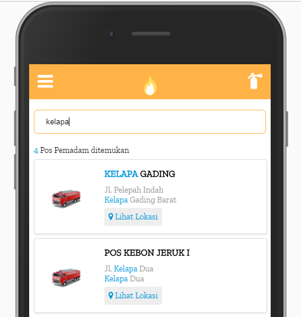

Salah satu fitur yang biasanya kita inginkan ketika membuat suatu kotak pencarian maupun autocomplete adalah highlight berdasarkan kata kunci yang digunakan untuk melakukan pencarian. Sebegitu mainstreamnya seperti sudah menjadi keharusan bagi setiap kotak pencarian untuk memiliki fitur ini. Untuk memudahkan Anda memahami apa yang saya maksudkan mungkin akan lebih mudah jika kita melihat gambar berikut :

Seperti terlihat pada gambar diatas, item yang dicari akan melakukan highlight berdasarkan kata kunci yang diketik oleh pengguna. Untungnya untuk membuat fitur seperti ini bisa dilakukan dengan mudah di Vue.js. Silahkan disimak beberapa langkah untuk membuat fitur search highlight ini :

## Membuat Search Box

Seperti terlihat pada gambar diatas, item yang dicari akan melakukan highlight berdasarkan kata kunci yang diketik oleh pengguna. Untungnya untuk membuat fitur seperti ini bisa dilakukan dengan mudah di Vue.js. Silahkan disimak beberapa langkah untuk membuat fitur search highlight ini :

## Menyiapkan Array Data

Karena kita akan melakukan searching atau pun filter maka salah satu bagian penting yang tidak lepas adalah array data, di dalam project FireJak sendiri saya menggunakan Vuex untuk mengambil data sehingga bisa dengan mudah diambil dengan menggunakan fitur getters yang sudah disediakan.

Sebagai contoh anggaplah saya punya array data seperti pada link berikut, https://github.com/mazipan/FireJak/blob/master/static/json/pospemadam.json

Maka bagian yang penting adalah meletakkan array data kedalam object data di dalam component Vue.js agar bisa diakses dengan mudah bahkan oleh object internal component. Pada contoh kali ini saya meletakkan pada object array posPemadam seperti yang terlihat pada gambar sebelumnya.

## Menampilkan semua array data

Menampilkan array data kedalam view dengan Vue.js bisa dengan mudah dilakukan menggunakan `v-for` seperti berikut:

## Memfilter array berdasarkan kata kunci

Yang akan kita lakukan adalah memantau variabel **v-model** input text kita kemudian melakukan filter pada array data ketika terjadi perubahan pada variabel tersebut. Untuk melakukan hal ini kita bisa memanfaatkan fitur computed maupun watch dari Vue.js, pada artikel [Pengetahuan Dasar Vue.js — Bagian 3](https://blog.vuejs.id/pengetahuan-dasar-vue-js-bagian-3/) kita sudah belajar mengenai computed dan watch, jika masih bingung atau belum bisa membedakan perbedaan dari keduanya bisa kembali membaca artikel tersebut.

Pada gambar diatas, saya menggunakan computed untuk menghasilkan array baru dengan nama `filteredList` yang akan selalu dieksekusi tiap kali terjadi perubahan variabel `searchText`. Karena data yang akan saya filter merupakan array of object, jadi saya harus mendefinisikan field apa saja yang ingin saya bandingkan dengan kata kunci.

## Mengganti view dengan array filter

Setelah membuat array baru hasil filter, maka kita akan mengganti view yang tadinya menampilkan semua data menjadi menampilkan hanya array hasil dari filter yang dijalankan. Berikut contoh kodenya:

## Membuat fungsi highlight

Fungsi yang akan kita buat pada dasarnya akan melakukan _replacement_ berdasarkan kata kunci yang ditemukan dari sebuah text yang dilemparkan. Fungsi ini akan mengembalikan sebuah string html dari kata awal yang telah disisipkan dengan class untuk _highlight_ text. Berikut contoh kodenya:

## Memanggil fungsi highlight

Karena fungsi highlight ini akan mengembalikan sebuah html dengan class highlight didalamnya, maka kita tidak bisa menggunakan data-binding biasa menggunakan `{{ data }}` tapi kita harus menggunakan v-html agar html yang menjadi balikan dari fungsi ini bisa ditampilkan dengan baik dan di-render sebagai html bukan sebagai string. Untuk memanggil fungsi highlight ini kita perlu melemparkan dua parameter yakni kata yang akan di highlight dan kata kunci yang dijadikan highlight keyword. Berikut contoh kodenya:

**Dan taraaaa 😃😃😃 Berhasil, berhasil 😆😆😆**

Tentu saja ini bukanlah satu-satunya cara untuk menerapkan fitur highlight pada search. Tapi ini bisa menjadi panduan bagi Anda yang ingin belajar dasar menerapkan fitur ini. Semua kode yang dibagikan pada artikel kali ini bisa dilihat dan dipelajari dari repository [FireJak](https://github.com/mazipan/FireJak) berikut:

- [mazipan/firejak](https://github.com/mazipan/FireJak)
