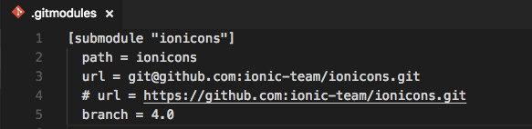
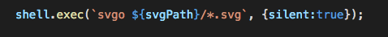
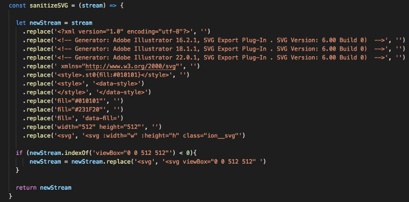
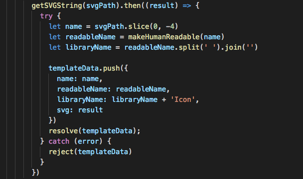
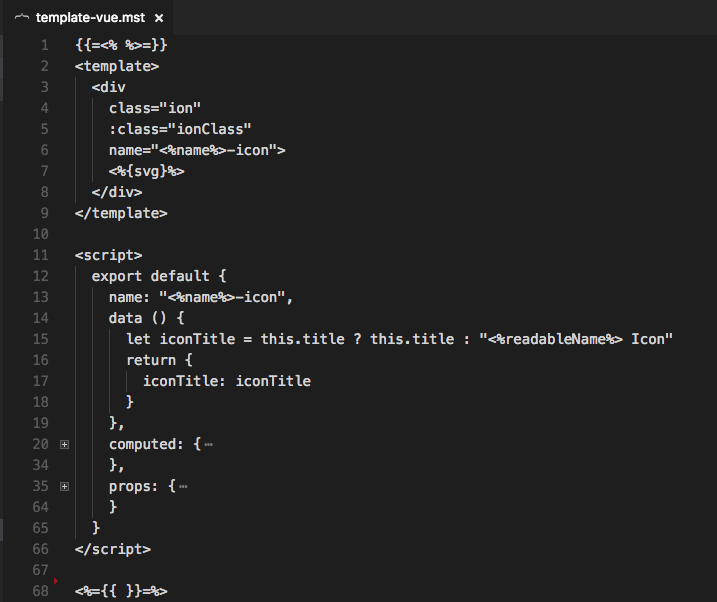
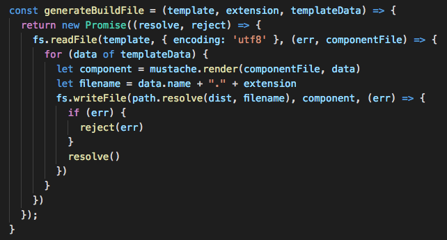
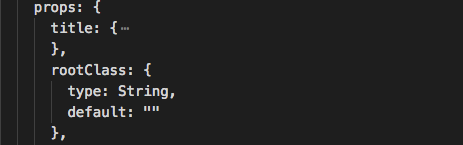
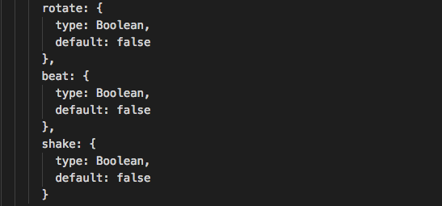
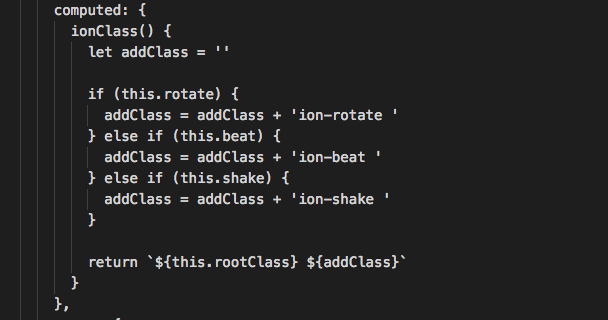
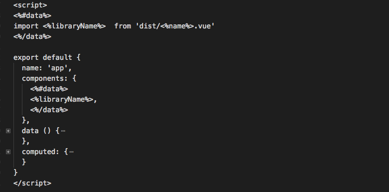

Pada artikel kali ini kita akan belajar bagaimana membuat icon pack sendiri dari sebuah SVG icon pack. Di **awesome-vue** sendiri sudah banyak ada icon packs versi vue.js yang bisa kita gunakan, selengkapnya lihat [disini](https://github.com/vuejs/awesome-vue#icons).

Awalnya saya tertarik untuk belajar dari [vue-awesome](https://github.com/Justineo/vue-awesome)— (Font Awesome component for Vue.js) dibuat, namun setelah mencoba melihat langsung ke repository-nya sepertinya kurang scale untuk saya karena harus mapping manual SVG icon ke file .js satu persatu. Lihat kode selengkapnya [disini](https://github.com/vuejs/awesome-vue#icons).

Setelahnya saya mencoba melihat repository [vue-material-design-icons](https://gitlab.com/robcresswell/vue-material-design-icons), saya pribadi lebih cocok dengan cara repository ini. Setelah mencoba lebih memahami alur kode yang dilakukan oleh repo ini, maka saatnya belajar membuat versi sendiri.

Hal pertama yang saya pikirkan adalah mencari Icon Packs yang gratis dan tersedia di Github. Saya pilih [Ionicons](https://github.com/ionic-team/ionicons) dari Ionic Teams. Dan berikut langkah-langkah untuk membuatnya:

### Setup

Yang paling saya suka dari vue-material-design-icons yang saya sebut diatas adalah memilih menggunakan [git submodule](https://git-scm.com/docs/git-submodule) agar bisa langsung mengambil SVG dari repository utama dibandingkan melakukan mapping manual. Berikut file .gitmodule yang saya buat agar mengambil repository dari Ionicons.

### Convert file SVG ke .vue

Pada vue-material-design-icons pada dasarnya memanfaatkan File [System(fs)](https://nodejs.org/api/fs.html) pada NodeJS untuk membaca semua file SVG yang ada di dalam suatu folder untuk kemudian menggunakan [Mustache.js](https://github.com/janl/mustache.js/) untuk me-render hasil SVG string yang dibaca dan membuat file .vue berdasarkan hasil render dari mustache ini.

Namun ternyata untuk men-convert Ionicons memang lebih tricky karena SVG yang tersedia tidak seragam struktur XML string nya. Berikut beberapa penyesuaian yang harus saya lakukan untuk melakukan convert SVG Ionicons ke file .vue:

### 👉 Compress dan cleanup file SVG

Untuk melakukan compress dan cleanup SVG ini saya menggunakan library [SVGO](https://github.com/svg/svgo). Awalnya saya memutuskan untuk menggunakan versi Node.js Module dari svgo seperti bisa dilihat pada contoh [disini](https://github.com/svg/svgo/blob/master/examples/test.js). Namun ternyata muncul beberapa unexpected error karena gagal convert beberapa SVG. Akhirnya saya memutuskan untuk menggunakan versi CLI dan memanfaatkan [shelljs](https://github.com/shelljs/shelljs) untuk menjalankan perintah tersebut.

### 👉 Replace beberapa unused string

Meskipun sudah menggunakan SVGO, ternyata masih terdapat beberapa string SVG yang tidak saya inginkan. Untuk menghilangkan ini saya menggunakan cara bar-bar dengan melakukan replace manual string saya tidak inginkan serta menambahkan string yang saya butuhkan.

### Render Menggunakan Mustache.js

Seperti disebutkan diatas, kita menggunakan Mustache.js untuk me-render string hasil dari membaca SVG ke dalam file .vue.

Untuk bisa me-render di Mustache.js saya akan membuat Object dari setiap file SVG yang telah dibaca, berikut kurang lebih Object yang dibuat:

Untuk bisa membuat file .vue kita akan membuat file mustache dengan ekstensi .mst yang fungsinya merender berdasarkan data yang ada. Berikut file mustache yang kita buat:

Setelah data didapat, maka kita bisa mem-render file mustache yang dibuat sebelumnya dengan data yang ada untuk kemudian membuat file .vue sebagai output-nya.

### Menambahkan Props

Untuk menambahkan *Props* sebenarnya mudah saja, kita tinggal tambahkan di dalam file mustache yang dibuat diawal. Misalkan saya menambahkan *props* **rootClass** sebagai custom class jika memang dibutuhkan custom style, maka saya tinggal menambahakan kode berikut:

Bagian yang lumayan mengesalkan adalah saya ingin menambahkan Props kedalam SVG string bukan ke *wrapper* SVG tersebut. Untuk melakukan hal ini saya melakukan *cheating* dengan *replace* manual attribut bawaan SVG dengan props yang saya inginkan.

### Dukungan Animasi

Tentu saja akan menarik bila ada sedikit animasi, apalagi setelah saya lihat ada library serupa di React yang sudah support animasi yakni [React-Ionicons](https://zamarrowski.github.io/react-ionicons/). Kita bisa belajar dari cara library ini membuat animasinya yang tentu saja akan lebih mudah diaplikasikan ke dalam kode Vue.js yang memang lebih simpel **#nooffense** 😙.

Kita cukup menambahkan props yang akan mengaktifkan masing-masing animasi:

Setelahnya kita bisa buat CSS class dan buat fungsionalitas untuk menentukan class mana yang harus dipakai. Untuk hal ini saya menggunakan *computed* dari Vue.js, berikut kodenya:

### Menyiapkan Halaman Demo

Untuk menyiapkan halaman demo tentu saja seperti biasa kita perlu setup beberapa file seperti `webpack.config`, `main.js`, `index.html` dan `App.vue`. File-file tersebut mungkin tidak akan saya jelaskan lagi, Anda bisa langsung melihat kedalam repository Github.

Hal yang berbeda adalah bahwa file App.vue yang ada di demo merupakan hasil generate dari Mustache. Ini saya lakukan karena harus memastikan icon yang di import ke dalam App.vue sama persis dengan file SVG yang tersedia. Dengan mustache saya bisa melakukan dynamic import berdasarkan hasil membaca folder SVG di *repository* Ionicons.

Demikian tulisan singkat dari saya, semoga bermanfaat. Semua kode yang dibagikan di artikel diatas bisa Anda temukan di Github repository berikut:

[mazipan/vue-ionicons Vue Icon Set Components from Ionic Team](https://github.com/mazipan/vue-ionicons)
