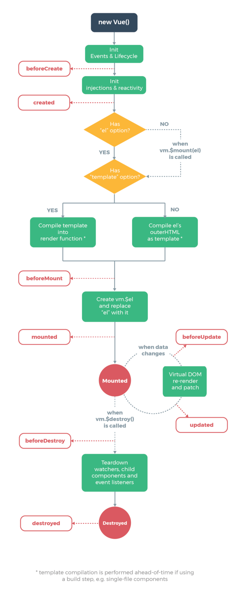

> Berbagai pengetahuan dasar yang perlu Anda ketahui di Vue.js.

Artikel ini merupakan seri lanjutan dari artikel yang sebelumnya sudah di publikasikan, baca semua seri Pengetahuan Dasar Vue.js:

1. [Pengetahuan Dasar Vue.js - Bagian 1](/pengetahuan-dasar-vuejs-bagian-1)
2. [Pengetahuan Dasar Vue.js - Bagian 2](/pengetahuan-dasar-vuejs-bagian-2) **(Anda di sini)**
3. Pengetahuan Dasar Vue.js - Bagian 3

---

Kali ini kita akan melanjutkan dengan membahas hal dasar lainnya dalam Vue.js, silahkan siapkan kopi dan simak artikel berikut :

## 1. Mengenal File .vue

Vue.js mengenalkan _single file component_ dimana kita bisa membuat satu file berekstensi `.vue` yang berisi html template, javascript function dan style layout. Sistem seperti ini terinspirasi dari JSX yang diadopsi di lingkungan React. File ini sangat memudahkan kita dalam mengatur struktur folder dalam suatu proyek karena tidak perlu lagi _foldering_ untuk memisahkan antar komponen.

```html
<template>
  <p>{{ greeting }} World!</p>
</template>

<script>
  module.exports = {
    data: function() {
      return {
        greeting: 'Hello'
      }
    }
  }
</script>

<style scoped>
  p {
    font-size: 2em;
    text-align: center;
  }
</style>
```

Menggunakan file `.vue` juga sangat-sangat mudah. Seperti terlihat pada gambar di atas dimana kita bisa mendeklarasikan tiga tag untuk memisahkan masing-masing bagian yakni `template` untuk html template, `script` untuk menyisipkan kode javascript, dan `style` untuk menyisipkan kode css maupun pre-processor nya.

Di dalam tag `template` kita bisa menyisipkan kode layaknya html biasa tanpa ada sedikitpun yang berbeda begitu pula di dalam tag `script` maupun `style`. Sedikit fitur dalam tag `style` kita bisa menambahkan `scoped` bila ingin menggunakan style yang di-isolasi dalam suatu komponen. kita juga bisa dengan mudah menambahkan `lang=scss` bila ingin menggunakan SASS misalnya. File .vue ini tentu saja tidak bisa dibaca oleh browser, oleh karenanya jangan lupa untuk menambahkan Loader di webpack bila ingin menggunakan file .vue ini yang hebatnya lagi sudah di generate oleh Vue-CLI bila kita menggunakan scaffolding official Vue.js ini.

## 2. Life Cycle Vue.js Component

Vue.js memiliki berbagai hook yang bisa kita gunakan sesuai dengan state di dalam _life cycle_ nya, misalkan `created` adalah hook yang akan di eksekusi ketika sebuah komponen berhasil diinisialisasi. Masalahnya adalah kita tidak boleh sembarangan mengunakan hook ini, mesti paling tidak harus tahu hook yang tersedia dan posisinya dalam. Karena bila salah menggunakan hook maka sangat mungkin kode yang kita buat tidak menghasilkan hal yang seharusnya. Untuk lebih memahami masing-masing hook ini mari sama-sama kita lihat gambar dibawah ini :



## 3. Data, Methods dan Props

Ketika belajar Vue.js kita akan sering bergelut dengan data, methods dan juga props. Ketiganya merupakan hal dasar yang perlu kita ketahui kegunaannya masing-masing.

### 👉 Data

Data di dalam Vue.js merupakan sekumpulan variabel yang digunakan oleh html template dan dapat dimanipulasi dan dimanfaatkan oleh internal komponen masing-masing dan tidak dapat diakses oleh komponen lainnya. Jadi sebuah variabel di dalam suatu komponen Vue.js hanya akan berpengaruh terhadap komponen itu sendiri.

Data sendiri bisa didefinisikan menggunakan syntax seperti yang terlihat pada gambar berikut :

```js
var data = { a: 1 }

// direct instance creation
var vm = new Vue({
  data: data
})
vm.a // => 1
vm.$data === data // => true

// must use function when in Vue.extend()
var Component = Vue.extend({
  data: function() {
    return { a: 1 }
  }
})
```

### 👉 Methods

Methods merupakan opsi dalam Vue.js yang berupa object berisi function-function. Function ini sendiri akan memiliki berbagai tujuan yang berbeda-beda dan bervariasi baik memanipulasi data ataupun melakukan sebuah logika bisnis sebuah aplikasi. Function di dalam methods juga bisa jadi sebuah Event yang bisa dipanggil dengan mudah di bagian html template dari komponen yang bersangkutan. Function bisa merupakan sebuah pure function yang me-return suatu nilai maupun berupa void function yang tidak mengembalikan nilai apapun.

Pembuatan methods bisa dilihat dalam gambar berikut :

```js
var vm = new Vue({
  data: { a: 1 },
  methods: {
    plus: function() {
      this.a++
    }
  }
})

vm.plus()
vm.a // 2
```

### 👉 Props

Props merupakan parameter yang bisa dilempar oleh sebuah komponen kepada komponen lainnya. Props merupakan satu dari beberapa jalan untuk mendistribusikan data dari satu komponen ke komponen lainnya. Jadi Props di suatu komponen akan memiliki nilai yang sama dengan nilai dari data yang dilemparkan oleh komponen parent nya.

Gambar dibawah merupakan contoh pembuatan Props dengan beberapa variasinya, sebagai berikut :

```js
// simple syntax
Vue.component('props-demo-simple', {
  props: ['size', 'myMessage']
})

// object syntax with validation
Vue.component('props-demo-advanced', {
  props: {
    // just type check,
    height: Number,
    //  type check plus other validations
    age: {
      type: Number,
      default: 0,
      required: true,
      validator: function(value) {
        return value >= 0
      }
    }
  }
})
```

---

Demikian sedikit penjelasan tentang beberapa hal dasar di Vue.js.

**Lanjut di Bagian 3 ya !!! Stay tuned dan follow publikasi ini 😅**

Terima kasih dan semoga bermanfaat penjelasan singkatnya.

---

<small>Gambar cover oleh [Piel Bover](https://medium.com/@Pier)</small>
