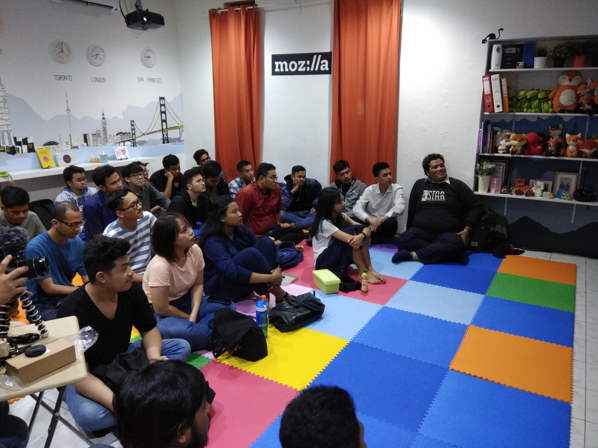
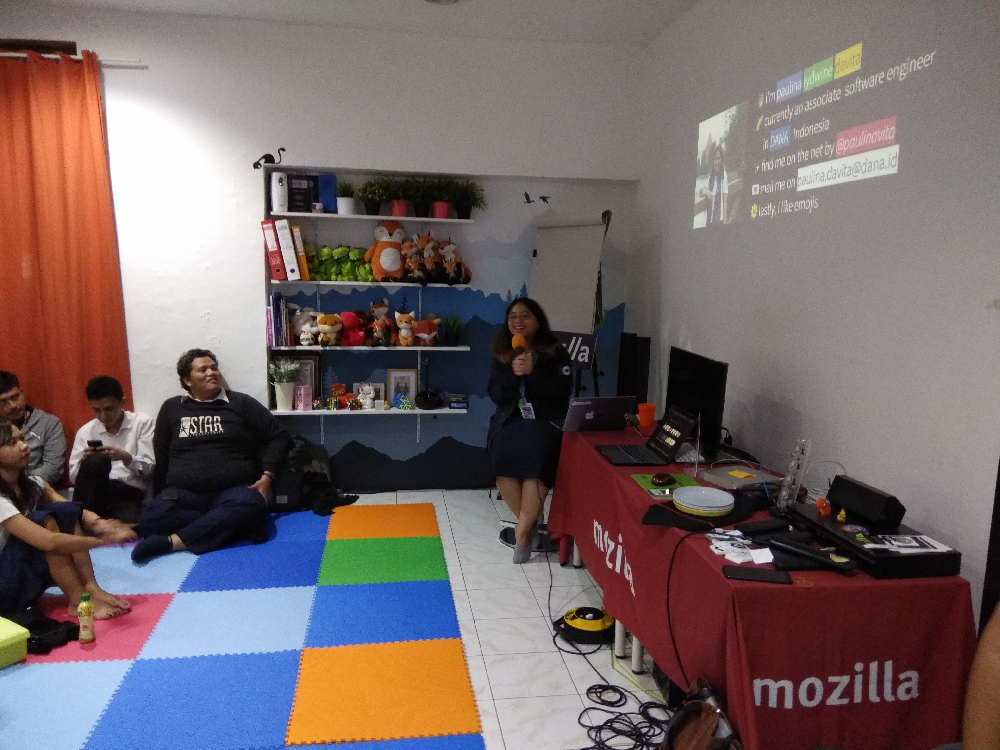
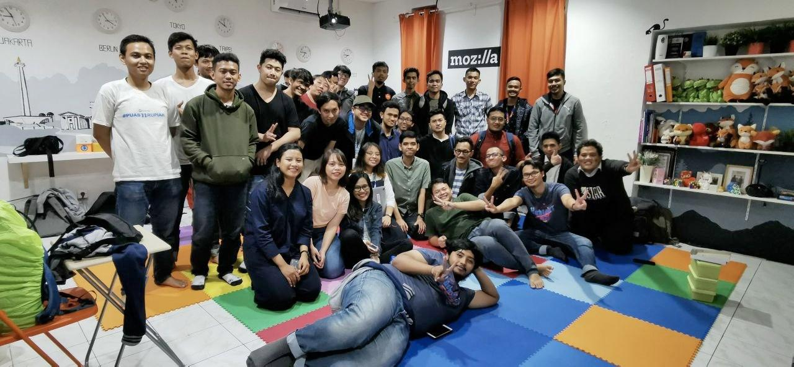

Ramai sekali untuk ukuran meetup pertama.

Antusiasme dari awal sudah terlihat untuk meetup pertama Vue.js ID, dalam beberapa jam saja udah penuh pendaftaran di [meetup](https://www.meetup.com/Vuejs-Indonesia/). Walaupun dari duduk jadi lesehan karena kursinya kurang haha, tetep seru.



Overal meetup sih berjalan lancar, tidak ada kendala. Materi - materi yang di dibawakan juga *yahud*. Yuk mari kita mulai materi pertama meetup Vue.js ID yang pertama kali!

## Lesson Learn in A11y - Adrianti Rusli

Nah, kak Adrian dari JYSK Group membawakan materi tentang `a11y` atau [aksesibilitas](https://id.wikipedia.org/wiki/Aksesibilitas) (*accessibility*) sebuah website, kenapa sih aksesibilitas itu penting banget untuk sebuah website? apalagi website - website umum seperti website pemerintahan.

> Berdasarkan data yang diambil oleh SUSENAS (Survei Sosial Ekonomi Nasional) pada tahun 2018 tentang jumlah penyandang disabilitas di Indonesia, terdapat ~180.000.000 penduduk berusia produktif (19–59 tahun) di Indonesia yang menyandang disabilitas yang mana jumlah ini merupakan 12% dari total penduduk Indonesia berusia produktif. (Adrianti R.)

Coba bayangkan salah satu penyandang disabilitas tersebut ingin mengurus pajak secara online? Ada kemungkinankah dia bisa mengisi form dengan baik dan benar?.

Web dibuat untuk semua orang, untuk memastikan bahwa web kita sepenuhnya dapat diakses oleh penyandang disabilitas kita juga perlu memperhatikan beberapa hal berikut

1. Gunakan HTML tag yang baik dan benar
2. Gunakan `aria-label` atau `role`
3. Perhatikan `tabindex` pada penggunaan form HTML\
4. Perhatikan kontras warna dan ukuran huruf
5. Gunakan tooling aksesibilitas ([vue-axe](https://github.com/vue-a11y/vue-axe), [chrome-lighthouse](https://developers.google.com/web/tools/lighthouse))

Walaupun banyak yang harus di perhatikan agar website kita dapat diakses oleh berbagai kalangan, tentu bukan hanya tanggung jawab kita sebagai seorang pengembang, tapi tanggung jawab semua orang yang terlibat pada proses pembuatan website. Karena kepanjangan **WWW** adalah **World Wide Web**, yuk perhatikan aksesibilitas website kita.

Baca lebih lanjut di [website Adrianti](https://adriantirusli.me/blog/a11y-vue/)

## Dive into Vue Composition API - Paulina L. Davita

Ditunggu - tunggu salah satu update Vue.js ini *Vue Composition API* yang katanya akan keluar pada akhir tahun 2020. Kali ini Paulina akan mencontohkan bagaimana sih cara-nya menggunakan *Vue Composition API* Apasih keuntungannya?



Vue composition API menjanjikan beberapa hal :

1. Ukuran bundel Vue.js yang lebih kecil
2. Peforma lebih cepat
3. *First Support* bagi pengguna [TypeScript](https://www.typescriptlang.org/)
4. Lebih maintainable (Mengurus kode lebih gampang)

Kenapa lebih kecil? Ternyata jika kita menggunakan *composition API* hanya fungsi yang kita pakai saja yang akan di bundle oleh webpack atau lebih nge-trend-nya *treeshakable*. Jika dalam aplikasi kita kita tidak menggunakan `onMounted` maka yah kode `onMounted` tersebut tidak bakal ikutan di aplikasi kita.

```js
// contoh treeshakable, dan penggunaaan vue composition API
import { reactive, computed } from 'vue'

export default {
  setup() {
    const state = reactive({
      count: 0,
      double: computed(() => state.count * 2)
    })

    function increment() {
      state.count++
    }

    return {
      state,
      increment
    }
  }
}
```

Lalu apakah benar lebih maintainable? Dengan kondisi Vue yang sekarang menganut prinsip *Single File Component*, kadang kalau kita ga sadar nih kita malah bikin komponen Vue yang cukup besar, bisa karena 'males misah', bisa juga karena kalau di pisah nanti akan susah maintain *state*-nya. Walaupun kita bisa aja pakai [*Renderless Component*](https://www.youtube.com/watch?v=j_WU0xx_O58) dengan berbagai *hack*-nya. 

Dengan *Composition API* nantinya kita dapat memisahkan code berdasarkan fitur dengan lebih mudah.

Tidak ada yang sempurna, *Composition API* juga memiliki beberapa kelemahan, apalagi sekarang masih *alpha* (belum rilis), berikut adalah beberapa kelemahannya:

1. Tidak berjalan di IE11 (Bisa di nonaktifkan kalau ingin support IE11)
2. Belajarnya agak susah kalau belum terbiasa.

Tertarik coba? langsung aja [nih kesini!](https://vue-composition-api-rfc.netlify.com/#summary). Cek juga [slide presentasi kak Paulina](https://drive.google.com/file/d/1FfyEPe-mLJj8JcGpM4G7sRIzcJ48CB2M/view).

## Penutupan

Nah, begitulah sekiranya rekap meetup Vue.js Indonesia yang pertama kali.

Jangan lupa Vue.js Indonesia merupakan sebuah komunitas yang bertujuan untuk memudahkan semua orang belajar programming, kita punya banyak proyek di komunitas ini beberapa diantaranya, menerjemahkan dokumentasi [Vue.js ke bahasa Indonesia](https://docs.vuejs.id/) dan [blog Vue.js](https://blog.vuejs.id/) yang juga berbahasa Indonesia.Kita juga mempunyai [grub telegram](https://t.me/vuejsindonesia) tempat kita saling diskusi dan bertanya seputar programming.

Jika teman - teman ada waktu luang yuk saling bantu agar komunitas ini terus berkembang dan lebih baik lagi, kalau bingung mau bantu apa, silahkan mention admin di grub telegram ~ selalu ada kerjaan dah haha. Sampai jumpa (￣▽￣)ノ


