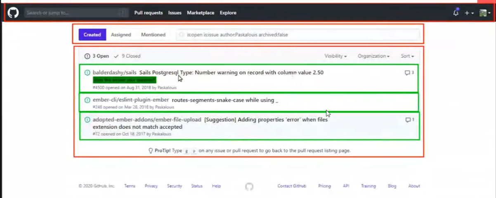
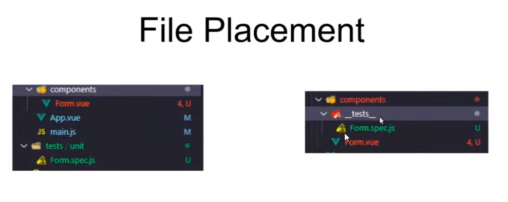

Meetup kedua Vue.js Indonesia, meetup pertama yang dilaksanakan secara daring (online) lewat google meet! tapi tenang - ada [VOD-nya kok](https://www.youtube.com/watch?v=0bHEhjLkA00), bahkan sampai ke bagian after meetup haha. Seperti biasa rekap ini dibuat agar teman - teman yang berhalangan hadir, maupun yang kurang suka format video lebih mudah mengambil hasil presentasi pembicara.

Nah pada meetup Vuejs.id ini kita ada 2 pembicara yang sama - sama akan ngobrol soal testing. Yuk mari kita langsung saja pada topik pertama meetup.

## Unit Test in Vue - Paskalouis Patressi

Paskalouis, adalah pengembang antar muka perangkat lunak di Bukalapak. Pas akan menjelaskan beberapa topik diantaranya :

1. Apa itu Unit test
2. Mengapa Harus ada Unit Test
3. Library unit test pada Vue
4. Unit test di Vue
5. TDD

### Apa itu unit test?

Unit test merupakan sebuah tindakan untuk melakukan tes pada sebuah unit/komponen perangkat lunak. Tujuanya, agar setiap unit/komponen perangkat lunak melakukan tindakan yang sesuai. Unit/komponen sendiri adalah bagain terkecil dari perangkat lunak yang dapat di tes. Unit merupakan sesuatu yang memiliki satu atau lebih input dan menghasilkan satu atau lebih output.

Dalam Vue contohnya komponen Vue itu sendiri atau fungsi dalam _methods_.

Tetsting tertiri dari 3 jenis **End to End (E2E)**, Integration, dan Unit. Kali ini Pas akan menjelaskan bagaimana sih cara unit testing di Vue.

```js
// contoh sebuah unit

// 1. function yang mau di test
function power() {
  return x ** y
}

// 2. test suite
describe('power method', () => {
  // 3. unit test
  it('should return 1', () => {
    // 4. assertion
    expect(power(1, 1)).toBe(1)
  })
})
```

Tautan kode diatas mencontohkan wujud unit test, dengan mengencek apakah _function power_ diatas mengembalikan nilai yang diharapkan.



Pada Vue (atau framework UI pada umumnya) Unit bisa di ibaratkan sebagai komponen issue card, komponen komen, ataupun komponen navbar.


### Kenapa harus ada unit test ?

Adanya unit test dapat memastikan bahwa setiap kode yang kita buat merupakan kode yang modular, tidak _sphagetti_ (berantakan), dapat di test denga baik.

Adanya Unit test memungkinkan kita sebagai tim/individu memiliki dokumentasi kode yang baik. Kalau ini nih pengalaman pribadi yak, biasanya kalau saya bingung gimana sih cara pakai pustaka A? kalau dokumentasi kurang lengkap saya biasanya lihat test mereka, dengan melihat tes kita tahu bahwa fungsi apa akan mengeluarkan output apa.

Kalau terdokumentasi dengan baik tentu kita akan lebih enak melempar kerjaan ke pewaris, jadi pewaris kode kita ga bingung "ini apaan sih?" haha.

_Refactor_-pun lebih mudah jika ada unit test, kita bisa mencocokan komponen yang kita buat dengan unit test tersebut.

Dan yang tidak kalah penting, keuntungan daripada unit test adalah biaya. Sebuah perangkat lunak tentu memiliki biaya, entah itu tenaga, waktu, maupun materi. Dengan adanya Unit test - _refactor_ yang mudah dan penambahan fitur tidak akan memakan waktu lama dikarenakan banyak kode tanpa test yang masih bersemayam di software kita.

Kode tanpa test tersebut, bisa saja menyebabkan bug pada fitur yang akan di tambah. Maka dari itu unit test dapat memastikan kelangsungan sebuah software.

### Pustaka Unit Test pada Vue.js

Ada beberapa pustaka yang dapat digunakan saat kita ingin menerapkan unit testing pada Vue. Beberapa pustaka meliputi [vue-test-utils](https://vue-test-utils.vuejs.org/), [jest](https://jestjs.io/), [mocha](https://mochajs.org/), [chai](https://www.chaijs.com/), dan masih banyak lagi.

Tapi yang paling populer adalah [vue-test-utils](https://vue-test-utils.vuejs.org/) yang tentunya mandatori kalau kalian melakukan test SFC (Single File Component) dan juga [jest](https://jestjs.io/). Dimana _jest_ merupakan _testing suite_ ada _test runner_, _assertion_, _js-dom_ (untuk tes pada DOM HTML) dan banyak lagi.

Nah kali ini Pas akan menjelaskan bagaimana caranya menggunakan 2 libary populer tsb.

Pengaturan dependensi yang perlu dilakukan adalah, installasi beberapa pustaka berikut :

```bash
$ yarn install @vue/cli-plugin-unit-jest jest vue-jest babel-jest @vue/test-utils
# atau jika menggunakan vue-cli
$ vue add @vue/unit-jest
```

Lalu untuk menggunakan sintaks ES6 pada file tes kita, kita harus menambahkan setup berikut pada _pacakge.json_

```json
{
  "jest": {
    "transform": {
      // proccess with babel-jest
      "^.+\\.js$": "<rootDir>/node_modules/babel-jest"
    }
  }
}
```

Nah sekarang kita sudah bisa meggunakan sintaks ES6 dalam file test kita. Tentu setup ini hanya berlaku untuk _jest_ yang lainnya bisa di cari di _mbah google_.



Untuk file placement, Pas lebih memilih menaruh test pada folder `__test__` di setiap komponen, jadi setiap komponen / modul jelas test-nya dimana dan tidak usah ribet mencari lagi.

#### Vue Test Utils

Vue test utils digunakan untuk mensimulasikan Vue SFC, digunakan untuk unit test. Vue test utils bisa juga digunakan unuk, mensimulasikan Vuex.

```js
import { shallowMount } from '@vue/test-utils'
// import Vue SFC
import Form from './Form.vue'

// 1st params Vue SFC,
// 2nd paras options
let wrapper = shallowMount(Form, {
  propsData: {
    title: 'VueJS Indonesia' // mensimulasikan props apakah berisi 'VueJS Indonesia'
  }
})
```

Ada 2 jenis fungsi untuk mensimulasikan Vue SFC, `shallowMount` seperti diatas dan `mount`. Berikut penjelasan-nya :

Jika menggunakan `mount` maka setiap komponen _child_ akan di _render_ semua, misal jika sebuah `<Form />` terdiri dari 2 Komponen (`<Input/>` dan `<Button />`), lalu komponen button tersebut mempunyai anak komponen lagi, misal `<ButtonIcon>`. Komponen `<ButtonIcon>` tersebut juka ikut di render.

Jika menggunakan `shallowMount` maka komponen, yang akan di render hanya komponen `<Input />`tersebut tanpa komponen anak-nya.

Jika ingin membuat test beserta komponen komponen di bawahnya mending memakai `shallowMount` di unit test komponen tersebut.

Templat test yang sering digunakan di Vue, juga sama dengan templat test yang ada pada javascript testing seperti umumnya.

```js
import { shallowMount } from '@vue/vue-test-utils'
import Form from './Form.vue'

describe('testing Form.vue', () => {
  let wrapper
  // mem passing value props
  beforeEach(() => {
    wrapper = shallowMount(Form, {
      propsData: {
        title: 'Hello Vuejs Indonesia'
      }
    })
  })

  it('should render props title when passed', () => {
    expect(wrapper.find('.qa-test-title').text()).toMatch(
      'Hello Vuejs Indonesia'
    )
  })
})
```

Kita juga bisa melihat apakah sebuah function itu terpanggil atau tidak, manipulasi form, mock API, dan mock event seperti _click_ semua cara bisa dilihat di dokumentasi [disini](https://vue-test-utils.vuejs.org)

### Demo

Setelah beberapa penjelasan tadi, Pas melakukan demo nih yang menarik, demo bisa dilihat [disini](https://youtu.be/0bHEhjLkA00?t=4825).

Jadi begitulah unit testing pada Vue, cukup simple dengan apa yang dicontohkan oleh Pas. Untuk melihat presentasi Paskalouis, bisa langsung ke menit [40:00](https://youtu.be/0bHEhjLkA00?t=2350) berakhir di menit [1:32:00](https://youtu.be/0bHEhjLkA00?t=5529)

## Create Simple UI Testing Tools - Akbar Nafisa Ja'far

Akbar, pengembang antar muka perangkat lunak di DANA kali ini akan menyampaikan bagaimana cara membuat 'Simple UI Testing Tools' berikut beberapa poin - poin penting yang akan dijelaskan oleh Akbar.

1. Latar Belakang Masalah (Testing Tools)
2. Apasih Visual Regression Testing
3. Solusi (of Visual Regression problem)
4. Pengembangan (on Visual Regression problem)
5. Alternatif (alternatif UI Testing tools)

### Latar Belakang Masalah

Presentasi Akbar di mulai di menit ke [1:44:00](https://youtu.be/0bHEhjLkA00?t=6289). Akbar memulai presentasi dengan menunjukan 2 gambar sebelum - sesudah, yang hanya berbeda sedikit. Jadi kenapa penting? Banyak orang selalau bilang bahwa tugas seoarang Pengembang UI (dalam kasus ini UI pada web) adalah menginplementasikan desain secara _Pixel perfect_.

Snapshot testing tidak dapat memberikan kita gambaran secara visual bagaimana aplikasi/web. Maka munculah Visual Regression Testing (selanjutnya akan disingkat VR).

### Solusi

_Regression_ adalah kembali ke-konteks sebelumnya, konteks disini adalah konteks visual. Maka Visual Regression adalah sebuah aktifitas testing untuk membantu menemukan kejanggalan visual setelah aplikasi ada perubahan.

VR Testing difokuskan pada Visual sebuah halaman web, untuk fungsionalitas kita akan tetap memakai Unit, E2E, dan Snapshot testing yang di jelaskan Paskalouis pada sesi pertama tadi

### Spesifikasi Alat

Untuk membuat sebuah alat VR kita dapat menggunakan [puppeteer](pptr.dev) untuk mengambil screenshoot, otomatisasi dan [pixelmatch](https://github.com/mapbox/pixelmatch) untuk membandingkan gambar.

### Demo

Pada demo Akbar mendemonstrasikan bagaimana caranya ia melakukan UI testing tools. Repo project [ada disini](https://github.com/akbarnafisa/vr). Demo dimulai pada waktu [berikut](https://youtu.be/0bHEhjLkA00?t=6918).

Banyak informasi penggunaan Visual Regression ini ada pada bagian demo. Ada 2 demo yang ditunjukan oleh Akbar.

### Pengembangan

Dalam demo tadi ada beberapa hal yang dapat di kembangkan lebih lanjut. _Puppeteer_ memakai Chrome sebagai engine-nya sedangkan website kita bisa saja berjalan di Firefox dan beberapa engine lain. Maka dimungkinkan mengganti alat tersebut dengan [playwright](https://github.com/microsoft/playwright) buatan microsoft yang merupakan _headless browser multi engine_ akan lebih bagus.

Lalu smartphone, kita juga harus membuat kondisi testing dengan semua ukuran layar website dan _user agent_ jadi yah, paling tidak kita lebih percaya diri saat website sudah sampai ke user.

Evironment, Akbar menggunakan macOS dalam demo yang ditunjukan. Dimungkinkan demo yang ditunjukan bisa saja tidak berjalan di Linux/Windows - silahkan yang mau coba - coba di OS lain sambil berkontribusi.

CI/CD, tentunya demo tadi dilakukan secara lokal, penerapan CI/CD nanti lebih beda lagi. Sepertinya bikin Github Bot soal itu enak kali ya haha.

### Alternatif

Beberapa tools yang sudah _production ready_ dapat digunakan untuk VR Testing.

1. [jest-image-snapshot](https://github.com/americanexpress/jest-image-snapshot)
2. [chromatic](https://github.com/chromaui)
3. [backstopJS](https://github.com/garris/BackstopJS)

Dan tidak lupa ada [awesome-regression-testing](https://github.com/mojoaxel/awesome-regression-testing) juga

## Penutup

Jadi ~ kalau saya sendiri menyimpulkan dari kedua pembicara kita tadi, mungkin beberapa poin bisa saya highlight:

1. Testing itu penting
2. Kestabilan itu dapat dicerminkan dari lengkapnya testing
3. Eksperimen dalam dunia testing

Nah. Yuk belajar dan implementasi testing pada proyek kita. Terimakasih sudah membaca (〃￣ ω ￣〃ゞ

Kalau ada yang mau lihat tanya jawab dan ngobrol santainya dimulai pada [menit ini](https://youtu.be/0bHEhjLkA00?t=8306).
